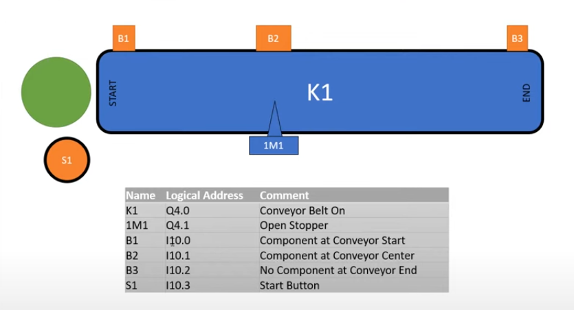
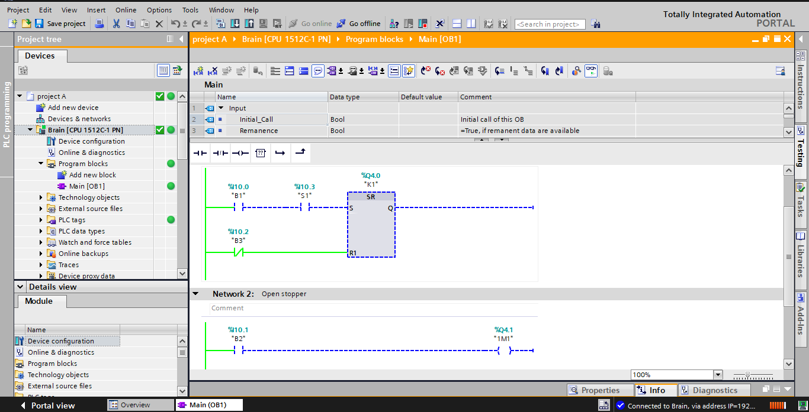

## Conveyor Belt (Simple) – TIA Portal v18 Project Init

This document introduces the simple conveyor belt project built in Siemens TIA Portal v18. It summarizes the intent, basic I/O, control, and how to simulate.

---

### 1) Project Overview
- **Goal**: Basic single-motor conveyor with start/stop and part detection.
- **Scope**: Standard PLC logic (no separate safety program in this minimal version).

---

### 2) Images
Use the `images` folder and keep these paths.

<small>Figure 1: Conceptual conveyor layout with motor and discharge sensor.</small>

<small>Figure 2: TIA Portal v18 online/PLCSIM  during test.</small>

---

### 3) Hardware & Software
- **CPU**: S7‑1200 or S7‑1500 (match model/firmware in hardware config)
- **TIA Portal**: v18 (same update level across machines)
- **Simulation**: PLCSIM (or PLCSIM Advanced)

---

### 4) I/O Mapping (Brief)
- Inputs: `I_StartPB`, `I_StopPB`, `I_PartSensor` (BOOL)
- Output: `Q_MotorRun` (BOOL)
- Internals: optional `M_RunCmd`, `M_Reset`, simple jam/fault bit

---

### 5) Control Logic (Brief)
- Start sets run command if no fault; Stop clears it.
- Motor run output follows run command.
- Optional jam/fault if sensor stays on too long; reset when stopped.

---

### 6) Simulation (PLCSIM)
1. Open project in TIA v18 and compile.
2. Start PLCSIM, load CPU, go online.
3. In a watch table: pulse `I_StartPB`, toggle `I_PartSensor`, use `I_StopPB`.
4. If using a jam timer, hold `I_PartSensor` ON to see fault; stop and pulse `M_Reset` to clear.

---

